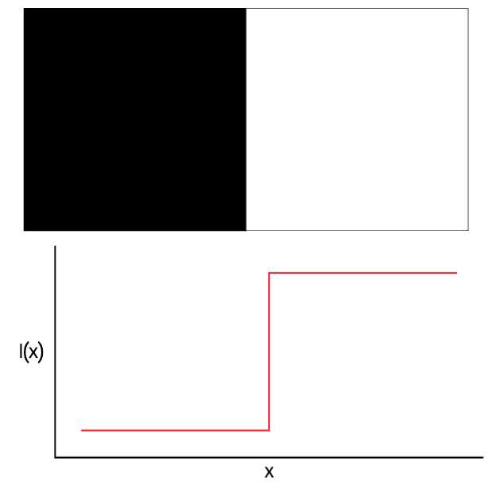
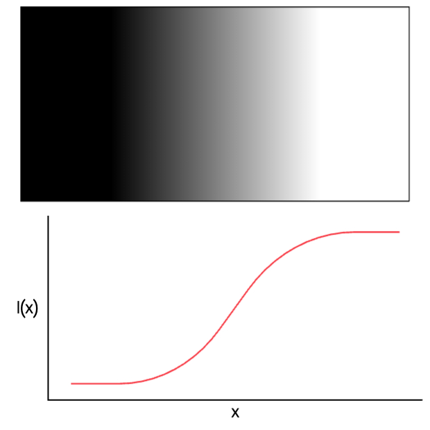
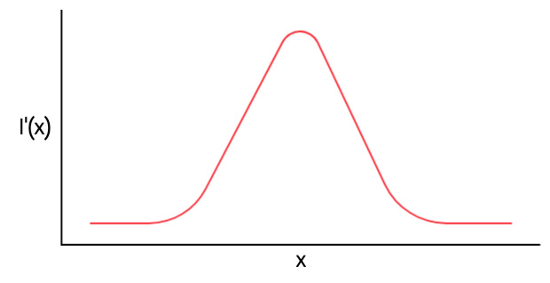
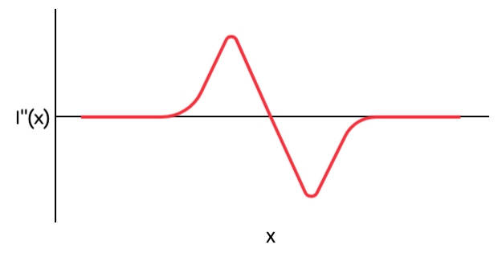

# Edge detection

## Table of contents (TODO)

## Introduction
What are edges, what are they useful for and how can we find them?
Edges are boundaries between objects. Inside images edges also represent sharp changes in brightness like changes in surface orientation and illumination changes like shadow cast boundaries. Further down we will find ways methods for detecting edges.

After we detect edges, we can use the results to find objects inside an image, analyse it. We can also use edge detection for shape recognition.

## Mathematical modeling
As we said edges are sharp changes in the brightness inside an image, thus the algorithms we'll present will work with grayscaled images.

A perfect edge would be a step function:

But unfortunately this is not always the case. The real case is usually a slighly blurred step:

How can we find them then? Well, we can take the first derivative of the intensity:

We can go even further, taking the second derivative:

As we can see, the first derivative has a peak at the edge and the second derivative has a zero crossing at the edge. Now the question is how do we find the derivatives. We can use the definition of derivatives: $\lim\limits_{t\to0}\frac{f(x + t) - f(x)}{t}$. In our case, we are in a discrete space, so we have a step $t=1$. From these we get the following approximations of the derivative:
* Forward difference: $f(x + 1) - f(x)$
* Backward difference: $f(x) - f(x - 1)$
* Central difference: $\frac{f(x + 1) - f(x - 1)}{2}$ (sum of forward and backward difference)

## References
* [1] [Digital Image Processing (4th edition), Rafael C. Gonzalez, Richard E. Woods](https://dl.icdst.org/pdfs/files4/01c56e081202b62bd7d3b4f8545775fb.pdf)
* [2] [OpenCV](https://docs.opencv.org/4.x/d7/da8/tutorial_table_of_content_imgproc.html)
